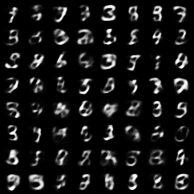

### Conditional Variational Autoencoder(CVAE)

Conditional Variational Autoencoder(CVAE)[^1]是Variational Autoencoder(VAE)[^2]的扩展，在VAE中没有办法对生成的数据加以限制，所以如果在VAE中想生成特定的数据是办不到的。比如在mnist手写数字中，我们想生成特定的数字2，VAE就无能为力了。
因此，CVAE通过对潜层变量和输入数据施加约束，可以生成在某种约束条件下的数据。

在VAE中目标函数如下所示：

![\log P ( X ) - D _ { K L } [ Q ( z | X ) \| P ( z | X ) ] = E [ \log P ( X | z ) ] - D _ { K L } [ Q ( z | X ) \| P ( z ) ]{\color{Red} }](http://latex.codecogs.com/gif.latex?%5Clog%20P%20%28%20X%20%29%20-%20D%20_%20%7B%20K%20L%20%7D%20%5B%20Q%20%28%20z%20%7C%20X%20%29%20%5C%7C%20P%20%28%20z%20%7C%20X%20%29%20%5D%20%3D%20E%20%5B%20%5Clog%20P%20%28%20X%20%7C%20z%20%29%20%5D%20-%20D%20_%20%7B%20K%20L%20%7D%20%5B%20Q%20%28%20z%20%7C%20X%20%29%20%5C%7C%20P%20%28%20z%20%29%20%5D%7B%5Ccolor%7BRed%7D%20%7D)

这个目标函数（主要考虑变分下界）要使输入数据经过编码后的潜层变量的分布尽量服从某种先验分布P(Z),并且最小化重建损失。在这个模型中，编码器直接基于输入X来建模潜层变量z，而不考虑潜层输入X的类型（标签），解码器直接基于潜层变量z来重建X，假设得到X1，并没有将要获得那种类型的X1考虑在内。

对VAE进行改进使其可以基于某种约束来生成对应的样本。以mnist手写数字为例，将数字的标签y考虑在内，即编码器为Q(z|X, y), 解码器为P(X|z, y)。上述模型可以写成下面的形式

![\log P ( X | y ) - D _ { K L } [ Q ( z | X ,y ) \| P ( z | X ,y ) ] = E [ \log P ( X | z ,y ) ] - D _ { K L } [ Q ( z | X ,y ) \| P ( z | y ) ]](http://latex.codecogs.com/gif.latex?%5Clog%20P%20%28%20X%20%7C%20y%20%29%20-%20D%20_%20%7B%20K%20L%20%7D%20%5B%20Q%20%28%20z%20%7C%20X%20%2Cy%20%29%20%5C%7C%20P%20%28%20z%20%7C%20X%20%2Cy%20%29%20%5D%20%3D%20E%20%5B%20%5Clog%20P%20%28%20X%20%7C%20z%20%2Cy%20%29%20%5D%20-%20D%20_%20%7B%20K%20L%20%7D%20%5B%20Q%20%28%20z%20%7C%20X%20%2Cy%20%29%20%5C%7C%20P%20%28%20z%20%7C%20y%20%29%20%5D)

潜层变量z的分布变成了条件概率分布P(z|X,y), 对解码器来说生成的样本也变成了条件概率分布Q(X|z, y)。

### CVAE的实现

本例使用mnist数据集，在VAE的基础上将标签y进行one-hot编码，之后和数据样本进行连接作为输入，在解码时，将潜层变量z和标签y的one-hot编码进行连接，以这种方式实现上述的条件概率分布。

### 实验结果

- 随机采样不同标签，模型在不同的训练阶段生成的结果如下：

- 模型在训练过程中对输入样本重建的结果

- - -
[^1]: Sohn, Kihyuk, Honglak Lee, and Xinchen Yan. “Learning Structured Output Representation using Deep Conditional Generative Models.” Advances in Neural Information Processing Systems. 2015.

[^2]: Kingma, Diederik P., and Max Welling. "Auto-encoding variational bayes." arXiv preprint arXiv:1312.6114 (2013).

